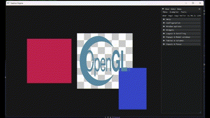
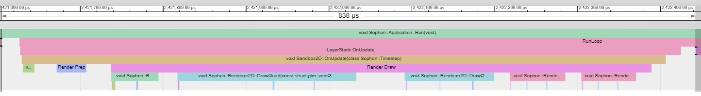

# Sophon Engine

An exercise in what's possible.

## Renderer Status

  
*Rendered in Engine =)*

## Development Quick Start
***Note: Only the Windows platform is really supported ATM but Linux support shouldn't be to much of an issue if/when that need arises***
1. Clone the repo
2. Run either `/Scripts/Setup.bat` or `/Scripts/Setup.sh` depending on your plaform (Python3 required)
3. Open the VisualStudio Project
4. Profit (or just build/run)

## Project Goals
- [x] Entry-point - launch the engine from a client
- [ ] Application Layer - app life-cycle, time, etc
	- [x] Create window
	- [ ] Subscribe to window events
		- [x] Close
		- [ ] Resize
  - [x] Timestep/Deltatime
- [ ] Window Layers
  - [x] Basic layer and layer-stack classes
	- [x] Update layers bottom-up
	- [x] Propagate input/events top-down through layers
	- [ ] Refactor/Review
- [ ] Input
  - [x] Poll user input
  - [x] Key codes
  - [x] Mouse codes
  - [ ] Decouple key/mouse codes from GLFW?
- [ ] Event System
	- [x] Basic synchronous event system (starting out)
	- [ ] Buffered event system (non-blocking)
	- [ ] Propagate through layers
- [ ] Renderer
  - [ ] High-level API
    - [x] Init
    - [ ] Shutdown
    - [x] OnWindowResize
    - [ ] BeginScene
    - [ ] EndScene
    - [x] Submit
    - [x] GetAPI (RendererAPI)
  - [ ] Generic Abstractions
    - [x] VertexBuffer
    - [x] VertexBufferLayout
    - [x] IndexBuffer
    - [x] VertexArray
    - [x] Shader
    - [x] Texture
      - [x] Texture2D
  - [ ] OpenGL Renderer
    - [x] VertexBuffer
    - [x] VertexBufferLayout
    - [x] IndexBuffer
    - [x] VertexArray
    - [x] Shader
    - [x] Texture
      - [x] Texture2D
  - [ ] Renderer2D
    - [x] Init/Setup
    - [x] DrawQuad
    - [x] Batching
    - [x] Basic Stats
    - [x] Draw Sprites (ECS)
  - [ ] Renderer (3D)
    - [x] Init/Setup
    - [ ] Batching
  - [ ] Framebuffer
    - [x] Bind/unbind as render target
  - [ ] Camera
    - [x] Base Camera
    - [x] Editor Camera
    - [x] Scene Camera (ECS Managed)
    - [ ] 3D Orthographic
    - [ ] 3D Perspective
- [ ] RendererAPI Abstraction
  - [ ] Ability to swap RendererAPI
  - [ ] Generic RendererAPI
    - [x] SetViewport 
    - [x] SetClearColor
    - [x] Clear
    - [x] DrawCall
    - [ ] Renderer Submission
  - [ ] OpenGL RendererAPI
    - [x] SetViewport 
    - [x] SetClearColor
    - [x] Clear
    - [x] DrawCall (DrawIndexed)
    - [ ] Renderer Submission
- [ ] Editor
  - [x] Editor "App"
  - [x] ImGui dockspace setup (renderer base)
  - [x] Viewport for main render target
- [ ] Debugging Support
	- [x] Logging
  - [x] Instrumented Profiling (Chrome)
	- [x] Basic ImGui Support
  - [x] Editor RenderStats panel
- [ ] Entity Component System (ECS)
  - [x] Entity
  - [x] Basic Components
- [ ] Scenes
  - [x] Entity API
  - [x] Copy API
  - [x] OnUpdateRuntime
  - [x] OnUpdateEditor
  - [x] Pause/Step ECS
- [ ] Scripting Language - C#, Lua, ???
- [ ] Memory - allocator, tracking, etc
- [ ] Physics
- [ ] Shader Compilation
  - [x] SPIR-V Cross
  - [x] Vulkan GLSL -> OpenGL GLSL
  - [ ] Vulkan GLSL -> Metal MSL
- [ ] Build System / Custom File Format
	- [x] PreMake

## Application Profiling
Sophon Engine can be profiled by enabling the `SFN_PROFILE` flag. The Premake generated DebugProfile configuration will set this for you or you can manually enable it in the `Debug/Instrumentor.h` file. When enabled, execution times will be recorded for many of the core functions. The "client" app can also use the same macros to debug it's own methods:
* `SFN_PROFILE_SCOPE(name)` - enables the capturing of metrics for all code executing within the current scope `{}`
* `SFN_PROFILE_FUNCTION()` - enables the capturing of metrics for all code executing within the functions scope `fn() {}`

Running the application with the profiler enabled will generate JSON files for startup, runtime, and shutdown, which can be read via the Chrome Tracing to visualize the application performance and easily identify potential bottlenecks.
1. Open Chrome to: `chrome://tracing/`
2. Drag or Load the file you want to visualize, example: `Sophon-Profiler-Data-Runtime.json`
3. You can use `W` and `S` to zoom in and out, mouse left-click and drag to pan the timeline
4. Happy Profiling!

  
*Example Runtime Profiling*
