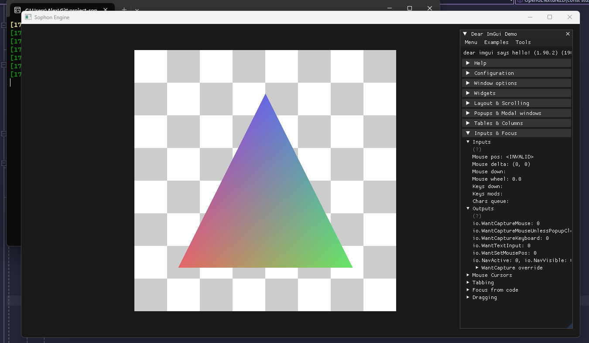

# Sophon Engine

An exercise in what's possible.

## Renderer Status

*Rendered in Engine =)*

## Development Quick Start
***Note: Only the Windows platform is really supported ATM but Linux supportshouldn't be to much of an issue if/when that need arises***
1. Clone the repo
2. Init/Update the submodules
3. Run the Premake script for your platform (/Scripts/Setup-#PLATFORM#.ext]
4. Open the VisualStudio Project
5. Profit (or just build/run)

## Project Goals
- [x] Entry-point - launch the engine from a client
- [ ] Application Layer - app life-cycle, time, etc
	- [x] Create window
	- [ ] Subscribe to window events
		- [x] Close
		- [ ] Resize
- [ ] Window Layers
  - [x] Basic layer and layer-stack classes
	- [x] Update layers bottom-up
	- [x] Propagate input/events top-down through layers
	- [ ] Refactor/Review
- [ ] Input
  - [x] Poll user input
  - [x] Key codes
  - [x] Mouse codes
  - [ ] Decouple key/mouse codes from GLFW?
- [ ] Event System
	- [x] Basic synchronous event system (starting out)
	- [ ] Buffered event system (non-blocking)
	- [ ] Propagate through layers
- [ ] Renderer
  - [ ] High-level API
    - [x] Init
    - [ ] Shutdown
    - [x] OnWindowResize
    - [ ] BeginScene
    - [ ] EndScene
    - [x] Submit
    - [x] GetAPI (RendererAPI)
  - [ ] Generic Abstractions
    - [x] VertexBuffer
    - [x] VertexBufferLayout
    - [x] IndexBuffer
    - [x] VertexArray
    - [x] Shader
  - [ ] OpenGL Renderer
    - [x] VertexBuffer
    - [x] VertexBufferLayout
    - [x] IndexBuffer
    - [x] VertexArray
    - [x] Shader
  - [ ] Camera
    - [x] 2D Orthographic
    - [ ] 3D Orthographic
    - [ ] 3D Perspective
- [ ] RendererAPI Abstraction
  - [ ] Ability to swap RendererAPI
  - [ ] Generic RendererAPI
    - [x] SetViewport 
    - [x] SetClearColor
    - [x] Clear
    - [x] DrawCall
    - [ ] Renderer Submission
  - [ ] OpenGL RendererAPI
    - [x] SetViewport 
    - [x] SetClearColor
    - [x] Clear
    - [x] DrawCall (DrawIndexed)
    - [ ] Renderer Submission
- [ ] Debugging Support
	- [x] logging
	- [x] basic ImGui
	- [ ] useful ImGui
	- [ ] other ImGui platforms?
- [ ] Scripting Language - C#, Lua, ???
- [ ] Memory - allocator, tracking, etc
- [ ] Entity Component System (ECS)
- [ ] Physics
- [ ] File I/O / VFS
- [ ] Build System / Custom File Format
	- [x] PreMake
